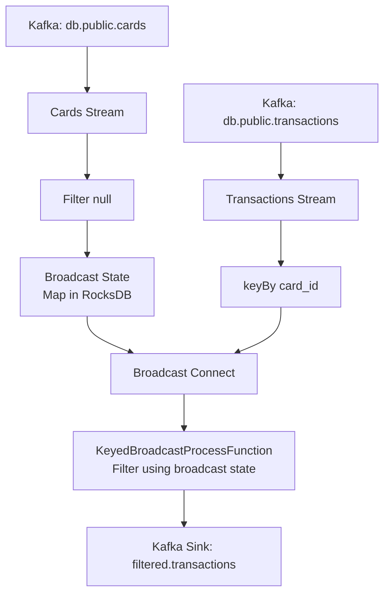

# Flink CDC Transaction Filter
**Real-time Transaction Filtering Using Java, PostgreSQL, Kafka CDC (Debezium), Apache Flink, Broadcast State & RocksDB**

---

## Goal

Filter **card transactions in real time** and forward **only** those belonging to cards with `auto_payment = true` to the `filtered.transactions` Kafka topic.

---

## Data Sources (CDC via Debezium)

| Topic | Source Table | Key Fields |
|------|--------------|------------|
| `db.public.cards` | `cards` | `card_id`, `auto_payment` (boolean) |
| `db.public.transactions` | `transactions` | `transaction_id`, `card_id`, `amount` |

---

## Flink Processing Pipeline



### Step-by-Step Flow

| Step | Description |
|------|-----------|
| 1. **Cards Stream** | Read CDC events from `cards` → filter nulls |
| 2. **Broadcast State** | `auto_payment = true` → `put(card_id, card)`<br>`auto_payment = false` → `remove(card_id)` |
| 3. **Transactions Stream** | Read CDC → `keyBy(card_id)` |
| 4. **Connect + Process** | `transactions.connect(broadcastCards).process(...)` |
| 5. **Filter Logic** | Check if `card_id` exists in **broadcast state** → emit if yes |
| 6. **Sink** | Write filtered transactions → `filtered.transactions` |

---

## State Management (RocksDB)

```java
MapStateDescriptor<String, Card> CARD_STATE_DESCRIPTOR = 
    new MapStateDescriptor<>("CardsState", String.class, Card.class);
```

- **State Type:** `MapState<String, Card>`
- **Backend:** `EmbeddedRocksDBStateBackend`
- **Path:** `file:///flink-cdc-demo/rocksdb`
- **Guarantees:** `exactly-once` via checkpointing
- **Sync:** Automatically replicated to **all parallel subtasks** via **broadcast**

---

## Key Features

- **Real-time CDC processing**
- **Low-latency enrichment** using broadcast state
- **Fault-tolerant** with RocksDB + exactly-once
- **Scalable** across Kafka partitions
- **No external database needed** for lookup

---

## Configuration

```java
env.enableCheckpointing(10_000, CheckpointingMode.EXACTLY_ONCE);
env.setStateBackend(new EmbeddedRocksDBStateBackend());
env.getCheckpointConfig().setCheckpointStorage("file:///flink-cdc-demo/rocksdb");
```

---

## Output

Only transactions where:
```json
{ "card_id": "C123", "auto_payment": true }
```
→ Will appear in `filtered.transactions`

---

## Run Locally (Prerequisites: Docker)

> **Demonstrating the project on your local machine, Docker must be installed on your computer.**

### Step-by-Step Setup

1. **Start the environment (Kafka, PostgreSQL, Flink, etc.)**
   ```bash
   docker-compose up -d
   ```

2. **Register the PostgreSQL Debezium connector**
   ```bash
   curl -X POST http://localhost:8083/connectors \
        -H "Content-Type: application/json" \
        -d @postgres-connector.json
   ```

3. **Check connector status**
   ```bash
   curl http://localhost:8083/connectors/postgres-connector/status
   ```

4. **Build the Flink job JAR**
   ```bash
   ./gradlew shadowJar
   ```
   > Output: `build/libs/flink-cdc-joiner.jar`

5. **Open Flink Web UI**
   [http://localhost:8081](http://localhost:8081)

6. **Submit the Flink job**
    - Go to **"Submit New Job"**
    - Upload: `build/libs/flink-cdc-joiner.jar`
    - Entry Class: `flink.demo.CardTransactionProcessor`
    - Set parallelism if needed (e.g., `1` for testing)
    - Click **Submit**

7. **Monitor Kafka topics**
   Open **Kafka UI**: [http://localhost:8085](http://localhost:8085)

---

## Tagline

> **"Keep card status in memory, filter transactions in real time!"**

---

*Built with Apache Flink 1.19.3, Kafka Connect, Debezium, RocksDB, and Java*